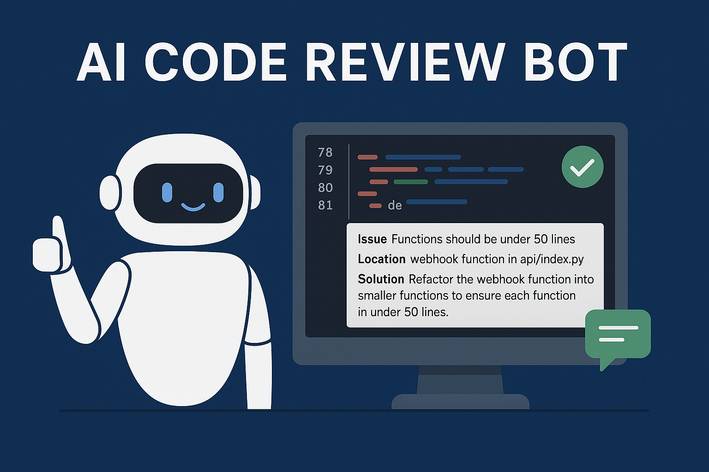

<div align="center">
  <h1>🤖 AI Code Review Bot</h1>
  <p>
    Automate your GitHub code reviews with the power of AI.
    <br/>
    Built using Flask, OpenAI GPT-4o, and GitHub Webhooks.
  </p>

  <p>
    <strong>Comment <code>/ai-bot</code> on a pull request, and let the AI do the review!</strong>
  </p>

  <br />

  <a href="#features">Features</a> |
  <a href="#quick-start">Quick Start</a> |
  <a href="#contribution-roadmap">Contribution Roadmap</a> |
  <a href="#demo">Demo</a> |
  <a href="#license">License</a>
</div>

---



---

## 💡 What is This?

`AI Code Review Bot` is a lightweight, Flask-based GitHub integration that:

- Fetches the pull request diff
- Analyzes it using OpenAI + custom rules
- Comments AI-based suggestions at the **bottom of each file** in the PR

Perfect for teams looking to reduce manual review time and improve consistency across projects.

---

## ⚙️ Features

- 🔍 Detects code violations based on your own `rules.txt`
- 💬 Posts summarized review comments grouped by file
- 🔐 Works with private GitHub repos via PAT
- 📦 Easy deployment via Vercel
- ✍️ Simple `/ai-bot` trigger in PR comment
- 💡 Easily extendable with more rules, filters, or models

---

## 🚀 Quick Start

### 1. Clone the Repo

```bash
git clone https://github.com/Prashant-Bhapkar/ai-code-review.git
cd ai-code-review
```

### 2. Add Rules

Create your `rules.txt` with rules like:

```
Do not use print statements for logging.
Always use 'with' when opening files.
Avoid hardcoded secrets.
```

### 3. Set Environment Variables

| Variable         | Description                    |
|------------------|--------------------------------|
| `OPENAI_API_KEY` | Your OpenAI API key            |
| `GITHUB_TOKEN`   | GitHub PAT with repo access    |


#### 🔐 GitHub Token Permissions

To enable the bot to fetch pull request diffs and post comments, you need to create a **Fine-Grained Personal Access Token (PAT)** with the following configuration:

#### 🧾 Repository Access

- ✅ Select **“Only select repositories”**
- Choose the repositories where this bot will be active

#### 📂 Repository Permissions

| Permission       | Access      | Why It's Needed                                 |
|------------------|-------------|--------------------------------------------------|
| `Metadata`       | ✅ Required | To read basic repo info (cannot be disabled)     |
| `Issues`         | ✅ Read/Write | To post review comments in PR discussions       |
| `Pull requests`  | ✅ Read/Write | To fetch PR diffs and review metadata           |
| `Webhooks`       | ✅ Read/Write | To configure and respond to GitHub Webhooks     |
| `Contents`       | ✅ Read      | (Optional) To inspect file contents if needed    |
| `Discussions`    | Optional    | Future support for discussion-based workflows    |

> ⚠️ Recommended to use the fine-grained token to limit scope and maintain better security.

### 4. Deploy (Optional)

You can host this using:
- 🟢 [Vercel](https://vercel.com) - *[Note: We have used Vercel for Deployment]*
- 🐳 Docker (add `Dockerfile` support)
- 🌐 Your own Flask server

---

## 🧪 Usage

1. Open a pull request in your GitHub repo
2. Comment on the PR with:

```
/ai-bot
```

3. Wait a few seconds — the bot will:
   - Fetch PR diff
   - Run your rules + AI
   - Post one comment per file, listing all issues found

---

## 🔥 Demo Output

```md
👀 AI Code Review Feedback for `api/index.py`:

1. Issue: Hardcoded API key
   Location: get_data()
   Solution: Use environment variables to store secrets

2. Issue: Function exceeds 50 lines
   Location: webhook
   Solution: Break the function into logical parts
```

---

## 🧩 Contribution Roadmap

> Help us extend this project! Here are ideas we’re exploring:

- [ ] Add severity levels (low, medium, high)
- [ ] Suggest auto-fix blocks using GitHub suggestions
- [ ] `/ai-explain` → Summarize PR changes in plain English
- [ ] Add rule-based filtering (security, performance, etc.)
- [ ] Log all reviews to `.ai-review.json` in PR
- [ ] Code quality scoring out of 100
- [ ] Slack/Discord alerts when review is posted
- [ ] GitHub Action version of this bot
- [ ] Store recurring issues per dev/email

---

## 📊 Tech Stack

- 🔥 Flask (Python)
- 🤖 OpenAI GPT-4o
- 🔙 GitHub Webhooks + REST API
- 🌐 Vercel / Docker ready
- ✅ JSON diff parsing
- 🧠 Custom rules engine

---

## 📄 License

This project is licensed under the [Apache License 2.0](./LICENSE) — © 2025 [Prashant Bhapkar](https://github.com/Prashant-Bhapkar)

---

<div align="center">
  <strong>Built with ❤️ & AI to help developers code better.</strong>
</div>
